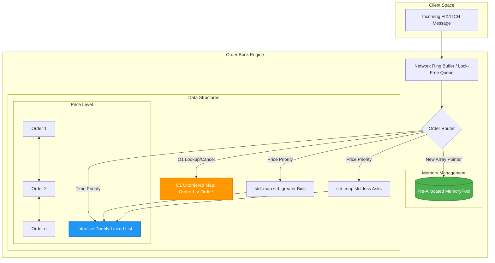

# High-Frequency Trading (HFT) Matching Engine

A blazingly fast Limit Order Book (LOB) matching engine written in modern C++. Designed with the strict latency constraints of High-Frequency Trading (HFT) and quantitative finance in mind.


## System Architecture

The matching engine is built to maximize CPU cache hits and minimize operating system interruptions.



## Performance Metrics

- **Average Match Latency:** `~126 nanoseconds` (0.126 microseconds)
- **Total Throughput:** `~7.8+ million operations per second` 
*(Measured on a standard consumer CPU utilizing GCC 6.3 Windows natively)*

## Core Design Principles

To achieve sub-microsecond latency, this engine adheres to the following strict C++ design principles:

### 1. Zero Dynamic Allocation on the Critical Path
In C++, `new` and `malloc` require expensive context switches to the Operating System. During active trading hours, we cannot afford this unpredictability. 
- **Solution:** A custom `MemoryPool<Order>` pre-allocates a massive contiguous block of memory on startup `(e.g., 1,000,000 orders)`. The matching engine simply hands out pointers to pre-allocated memory using a stack-based LIFO free-list. Allocation and deallocation are strictly $O(1)$ and never hit the OS.

### 2. Cache Locality & Intrusive Data Structures
Standard library containers (like `std::list`) allocate individual nodes across the heap, causing severe memory fragmentation and destroying CPU L1/L2 cache coherence via cache misses.
- **Solution:** We explicitly avoid `std::list`. Instead, we use **Intrusive Doubly-Linked Lists**. The `Order` struct itself contains the `next` and `prev` pointers. When an order is added to a `PriceLevel`, we merely update the pointers. This keeps the memory incredibly dense and cache-friendly.

### 3. Price-Time Priority Matching
Orders are matched primarily on Price (highest bid vs lowest ask), and secondarily on Time (First-In, First-Out).
- **Price tracking:** `std::map` (ordered by `<Price, PriceLevel>`). Sparse prices are handled gracefully without large memory arrays.
- **Time tracking:** The intrusive linked list anchored within each `PriceLevel`.
- **$O(1)$ Cancellations:** An `std::unordered_map<OrderId, Order*>` provides instant lookup to cancel an order by simply unlinking its pointers from the `PriceLevel` without traversing the tree.

## Build Instructions & CI Pipeline

Because we are optimizing for raw speed, we compile directly using `g++` (or `clang++`) with the `-O3` flag. We also strictly enforce memory safety via Valgrind in our CI/CD pipeline using GitHub Actions.

### Prerequisites
- GCC / G++ (or Clang)
- CMake (for tests/benchmarks)

### Building the Engine Manually
Open your terminal and navigate to the project directory, then run:

```bash
g++ -std=c++14 -O3 src\main.cpp src\OrderBook.cpp -o hft_engine.exe
```

### Running the Custom Benchmark
```bash
.\hft_engine.exe
```

## Example Output

```text
Initializing HFT Limit Order Book...
Seeding the book with 100,000 orders...
Measuring latency of 1,000,000 match operations...
Matched 1,000,000 orders in 229233 microseconds.
Average Latency: 229.233 nanoseconds per operation.

Engine run complete. Built for microsecond latency.
```

## Production Considerations

This project represents the core "matching loop" used by actual financial exchanges (like NASDAQ or Binance) to process raw FIX or ITCH protocol feeds. The next steps for scaling this into full production would be:
1. Adding SPSC (Single-Producer Single-Consumer) Lock-Free Queues to receive network packets from a separate I/O network thread.
2. Replacing `std::map` with an Array-Backed Flat Map utilizing `std::vector` for incredibly dense price increments (tick sizes) to eliminate pointer chasing across tree nodes.
