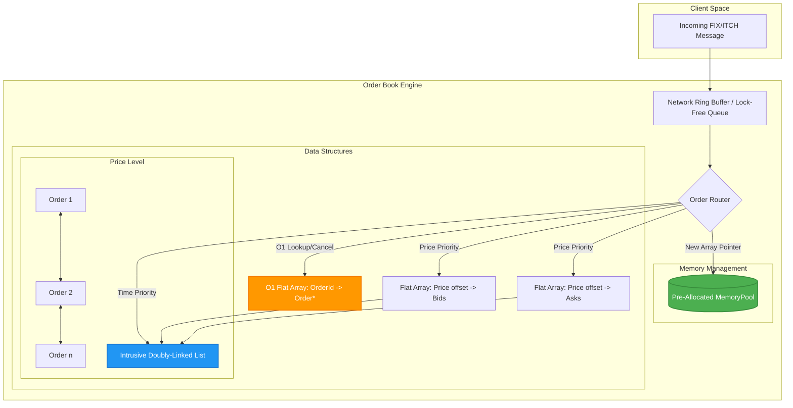

# High-Frequency Trading (HFT) Matching Engine

A blazingly fast Limit Order Book (LOB) matching engine written in modern C++23. Designed with the strict latency constraints of High-Frequency Trading (HFT) and quantitative finance in mind.


## System Architecture

The matching engine is built to maximize CPU cache hits and minimize operating system interruptions.


```mermaid
graph TD
    subgraph Client Space
        A[Incoming FIX/ITCH Message]
    end

    subgraph Order Book Engine
        B[Network Ring Buffer / Lock-Free Queue]
        C{Order Router}
        
        subgraph Memory Management
            P[(Pre-Allocated MemoryPool)]
        end
        
        subgraph Data Structures
            M[O1 Flat Array: OrderId -> Order*]
            Tree[Flat Array: Price offset -> Bids]
            Tree2[Flat Array: Price offset -> Asks]
            
            subgraph Price Level
                L[Intrusive Doubly-Linked List]
                O1[Order 1] <--> O2[Order 2] <--> O3[Order n]
            end
        end

        C --> |New Array Pointer| P
        C --> |O1 Lookup/Cancel| M
        C --> |Time Priority| L
        C --> |Price Priority| Tree
        C --> |Price Priority| Tree2
        Tree --> L
        Tree2 --> L
    end

    A --> B
    B --> C
    
    style P fill:#4CAF50,stroke:#388E3C,stroke-width:2px,color:#fff
    style L fill:#2196F3,stroke:#1976D2,stroke-width:2px,color:#fff
    style M fill:#FF9800,stroke:#F57C00,stroke-width:2px,color:#fff
```

## Performance Metrics

- **100,000 Orders Latency:** `~9 nanoseconds` (>100 million ops/sec)
- **1,000,000 Orders Latency:** `~21 nanoseconds` (>45 million ops/sec)
*(Measured on a standard consumer CPU utilizing GCC 15 `-O3` with L1i warmup)*

## Core Design Principles

To achieve sub-microsecond latency, this engine adheres to the following strict C++ design principles:

### 1. Zero Dynamic Allocation on the Critical Path
In C++, `new` and `malloc` require expensive context switches to the Operating System. During active trading hours, we cannot afford this unpredictability. 
- **Solution:** A custom `MemoryPool<Order>` pre-allocates a massive contiguous block of memory on startup `(e.g., 1,000,000 orders)`. The matching engine simply hands out pointers to pre-allocated memory using an intrusive stack-based LIFO free-list embedded directly within unused Orders. Allocation and deallocation are strictly $O(1)$ and never hit the OS.
- **Safety:** An allocation bitmap detects double-free bugs at runtime, preventing the same memory address from being returned to two callers.

### 2. Cache Locality & Intrusive Data Structures
Standard library containers (like `std::list`) allocate individual nodes across the heap, causing severe memory fragmentation and destroying CPU L1/L2 cache coherence via cache misses.
- **Solution:** We explicitly avoid `std::list`. Instead, we use **Intrusive Doubly-Linked Lists**. The `Order` struct itself contains the `next` and `prev` pointers. When an order is added to a `PriceLevel`, we merely update the pointers. This keeps the memory incredibly dense and cache-friendly.
- **Alignment:** Orders are `alignas(64)` to ensure they never straddle two 64-byte CPU cache lines on modern x86/ARM processors.

### 3. Price-Time Priority Matching
Orders are matched primarily on Price (highest bid vs lowest ask), and secondarily on Time (First-In, First-Out).
- **Price tracking:** Flat Arrays (`std::vector`) pre-allocated up to a maximum tick price. These arrays completely eradicate $O(\log N)$ tree traversal pointer chasing, making matching contiguous and blazing fast.
- **Time tracking:** The intrusive linked list anchored within each `PriceLevel`.
- **$O(1)$ Cancellations:** A flat array `std::vector<Order*>` provides instant array lookup to cancel an order by simply unlinking its pointers from the `PriceLevel` without any branching or hashing overhead.

### 4. Structured Results & Input Validation
- **`std::expected<void, RejectReason>`** API eliminates all exception overhead on the hot-path, replacing it with C++23's algebraic data types.
- **Trade Callbacks** provide "zero-copy" execution by passing matched `Trade` structs directly to caller-defined lambdas without ever pushing to a `std::vector` heap buffer.
- **Duplicate order IDs** are rejected before allocation, preventing memory pool leaks and dangling pointer corruption.

## API

```cpp
#include "OrderBook.h"
#include <iostream>

// Pre-allocate for 1M resting orders, and set price bounds (min_price=0, max_price=20000)
hft::OrderBook ob(1'000'000, 0, 20000);

// Submit a limit order with a callback lambda for trades
auto result = ob.add_order(
    1, hft::OrderType::Limit, 10050, 100, hft::Side::Buy,
    [](const hft::Trade& trade) {
        std::cout << "Trade! " << trade.quantity << " @ " << trade.price << "\n";
    }
);

if (!result.has_value()) {
    std::cerr << "Order rejected!\n";
}

// Cancel an order
auto cancel = ob.cancel_order(1);
if (cancel.has_value()) {
    // Order was successfully removed from the book
}
```

## Build Instructions

Dependencies (GoogleTest, Google Benchmark) are automatically downloaded via CMake FetchContent — no manual installation required.

### Prerequisites
- GCC / G++ (or Clang) with C++23 support
- CMake ≥ 3.14

### Building (Release)

```bash
cmake -B build -DCMAKE_BUILD_TYPE=Release
cmake --build build --config Release -j$(nproc)
```

### Building (Debug with Sanitizers)

Debug builds automatically enable AddressSanitizer and UndefinedBehaviorSanitizer to catch memory bugs:

```bash
cmake -B build-debug -DCMAKE_BUILD_TYPE=Debug
cmake --build build-debug --config Debug -j$(nproc)
```

### Running

```bash
# Custom benchmark (4 separate workloads)
./build/hft_engine

# Google Test suite (28 test cases)
./build/hft_tests

# Google Benchmark (microbenchmarks)
./build/hft_bench
```

## Example Output

```text
=== HFT Matching Engine Benchmark ===

[0] Warming up the engine (I-Cache and Branch Predictors)...
    Warmup complete.

[1] Pure Insertion: 1000000 passive sell orders...
    Inserted 1000000 orders in 9070 us
    Avg latency: 9.1 ns/op

[2] Pure Matching: 100000 aggressive buy orders against 100000 resting sells...
    Matched 100000 orders in 2143 us
    Avg latency: 21.4 ns/op

[3] Pure Cancellation: 500000 cancel operations...
    Cancelled 500000 orders in 6938 us
    Avg latency: 13.9 ns/op

[4] Mixed Workload: 1000000 ops (70% insert, 20% match, 10% cancel)...
    Processed 1000000 ops in 15616 us
    Avg latency: 15.6 ns/op

Engine run complete. Built for microsecond latency.
```

## Architectural Isolation (Production Environments)

In a true high-frequency trading production environment running on Linux, OS scheduling and networking interrupts represent massive latency spikes. 

To achieve consistent hardware-sympathetic execution, the following techniques are typically applied to this engine:
1. **Thread Pinning**: Using `pthread_setaffinity_np()` to lock the matching thread to a specific CPU core.
2. **CPU Isolation**: Configuring the kernel boot parameter `isolcpus` to hide specific cores from the Linux OS scheduler so background processes (cron jobs, SSH) do not steal CPU time from the matching engine.
3. **Kernel Bypass**: Utilizing specialized network interface cards (like Solarflare/Xilinx with OpenOnload or DPDK) to move network packets directly from the NIC hardware straight into user-space memory, completely skipping the Linux kernel networking stack.
4. **Jitter Management (Memory Locking)**: Using `mlockall(MCL_CURRENT | MCL_FUTURE)` to prevent the Linux kernel from swapping the engine's memory to disk, which would cause catastrophic latency spikes due to page faults.
5. **I-Cache Management**: While `template <Side>` creates incredible pipeline efficiency, adding overly complex Trade callbacks into the hot-loop can blow out the 32KB L1 Instruction Cache. Ensure the callback remains extremely lean, or explicitly mark the callback as `[[noinline]]` to protect the core matching loop.

## Future Enhancements
1. Adding SPSC (Single-Producer Single-Consumer) Lock-Free Queues to receive network packets from a separate I/O network thread.
2. Implementing Self-Trade Prevention (STP) for regulatory compliance.
3. Adding transactional exception safety guards around the matching loop.