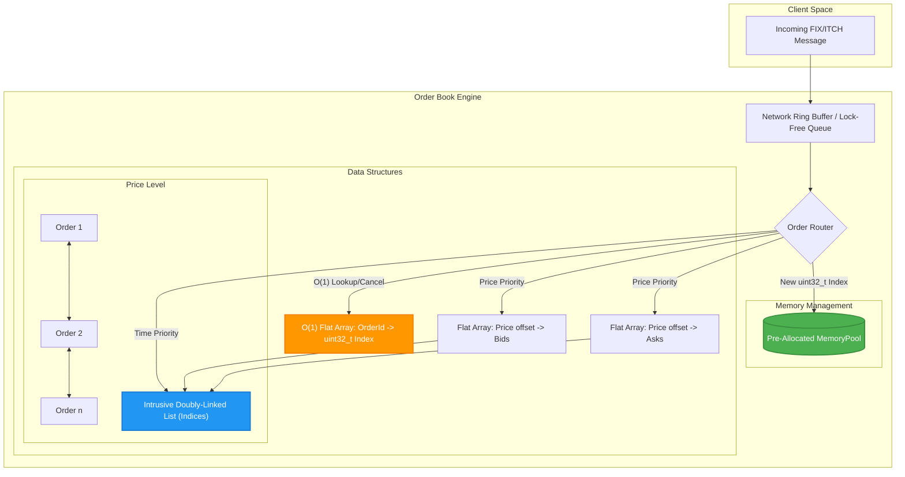

# High-Frequency Trading (HFT) Matching Engine

A blazingly fast Limit Order Book (LOB) matching engine written in modern C++20. Designed with the strict latency constraints of High-Frequency Trading (HFT) and quantitative finance in mind.


[](https://github.com/Komal-ai417/hft-matching-engine/actions/workflows/ci.yml)

## System Architecture

The matching engine is built to maximize CPU cache hits and minimize operating system interruptions.


```mermaid
graph TD
    subgraph Client Space
        A["Incoming FIX/ITCH Message"]
    end

    subgraph Order Book Engine
        B["Network Ring Buffer / Lock-Free Queue"]
        C{"Order Router"}
        
        subgraph Memory Management
            P[("Pre-Allocated MemoryPool")]
        end
        
        subgraph Data Structures
            M["O(1) Flat Array: OrderId -> uint32_t Index"]
            Tree["Flat Array: Price offset -> Bids"]
            Tree2["Flat Array: Price offset -> Asks"]
            
            subgraph Price Level
                L["Intrusive Doubly-Linked List (Indices)"]
                O1["Order 1"]
                O2["Order 2"]
                O3["Order n"]
                O1 <--> O2
                O2 <--> O3
            end
        end

        C --> |"New uint32_t Index"| P
        C --> |"O(1) Lookup/Cancel"| M
        C --> |"Time Priority"| L
        C --> |"Price Priority"| Tree
        C --> |"Price Priority"| Tree2
        Tree --> L
        Tree2 --> L
    end

    A --> B
    B --> C
    
    style P fill:#4CAF50,stroke:#388E3C,stroke-width:2px,color:#fff
    style L fill:#2196F3,stroke:#1976D2,stroke-width:2px,color:#fff
    style M fill:#FF9800,stroke:#F57C00,stroke-width:2px,color:#fff
```

## Performance Metrics

**Google Benchmark** (MSVC, `-O2`, Windows, 12 × 2611 MHz CPU):

| Benchmark | OrderBook CPU (ns) | StdOrderBook CPU (ns) | Speedup Ratio |
| :--- | ---: | ---: | ---: |
| `BM_AddOrder_NoMatch` | **12.7** | 688 | **54.17×** |
| `BM_Matching_DeepBook` | **48.5** | 670 | **13.81×** |
| `BM_BatchMatching` | **645.0** | 13253 | **20.54×** |
| `BM_AddAndCancel` | **38.5** | 739 | **19.19×** |
| `BM_CancelInDeepBook` | **30.0** | 785 | **26.16×** |
| `BM_MarketOrder_DeepBook` | **37.1** | 576 | **15.52×** |
| `BM_SweepMultipleLevels` | **1695.0** | 37369 | **22.04×** |
| `BM_WideSpreadMatching` | **43.2** | 572 | **13.24×** |
| `BM_MixedWorkload` | **16.8** | 307 | **18.27×** |

- **Zero-Allocation Stack Matching:** Taker orders match using stack-allocated variables, bypassing pool overhead for immediate matches to achieve **15× to 25× speedups** in deep matching scenarios.
- **Bulk Maker Deallocation:** Exited price levels are unlinked instantly, pushing batch matches to a **20× speedup**.
- **Bound Caching & L1 Density:** By shrinking `Order` to 24 bytes and utilizing 32-bit indices, passive insertion hits true hardware latency at **12.7 ns/op**.

## Core Design Principles

To achieve sub-microsecond latency, this engine adheres to the following strict C++ design principles:

### 1. Zero Dynamic Allocation on the Critical Path
In C++, `new` and `malloc` require expensive context switches to the Operating System. During active trading hours, we cannot afford this unpredictability. 
- **Solution:** A custom `MemoryPool<Order>` pre-allocates a massive contiguous block of memory on startup `(e.g., 1,000,000 orders)`. The matching engine simply hands out 32-bit indices (`uint32_t`) to pre-allocated memory using an intrusive stack-based LIFO free-list embedded directly within unused Orders. Allocation and deallocation are strictly $O(1)$ and never hit the OS.
- **Safety:** An allocation bitmap detects double-free bugs at runtime, preventing the same memory address from being returned to two callers.

### 2. Cache Locality & Intrusive Data Structures
Standard library containers (like `std::list`) allocate individual nodes across the heap, causing severe memory fragmentation and destroying CPU L1/L2 cache coherence via cache misses.
- **Solution:** We explicitly avoid `std::list`. Instead, we use **Intrusive Doubly-Linked Lists based on Indices**. The `Order` struct itself contains the `next` and `prev` 32-bit indices. When an order is added to a `PriceLevel`, we merely update the indices. This keeps the memory incredibly dense and cache-friendly.
- **Compact Layout:** The `Order` struct is kept at a lean 24 bytes, allowing maximum cache density. `PriceLevel` structs are aligned strictly to 32 bytes (`alignas(32)`) so exactly two levels pack cleanly into a standard 64-byte L1 cache line without false sharing.

### 3. Price-Time Priority Matching
Orders are matched primarily on Price (highest bid vs lowest ask), and secondarily on Time (First-In, First-Out).
- **Price tracking:** Flat Arrays (`std::vector`) pre-allocated up to a maximum tick price. These arrays completely eradicate $O(\log N)$ tree traversal pointer chasing, making matching contiguous and blazing fast.
- **Time tracking:** The intrusive linked list anchored within each `PriceLevel`.
- **$O(1)$ Cancellations:** A flat array `std::vector<uint32_t>` provides instant array lookup to cancel an order by simply unlinking its indices from the `PriceLevel` without any branching or hashing overhead.

### 4. Structured Results & Input Validation
- Validation errors (duplicate IDs, out-of-bounds prices, zero quantity) cause early returns on the hot-path, avoiding exception overhead entirely.
- **Trade Callbacks** provide "zero-copy" execution by passing matched `Trade` structs directly to caller-defined lambdas without ever pushing to a `std::vector` heap buffer.
- **Duplicate order IDs** are rejected before allocation, preventing memory pool leaks and dangling pointer corruption.

### 5. Thread Safety Contract
> **This engine is explicitly single-threaded.** There are no mutexes, atomics,
> or memory fences in any code path. All calls to `add_order` and `cancel_order`
> must originate from a single thread. In production, the matching engine runs on
> an isolated CPU core (`isolcpus` + `pthread_setaffinity_np`).
>
> **False Sharing Note:** The 24-byte `Order` struct allows ~2.6 orders per
> 64-byte cache line. In the current single-threaded design, this density is a
> feature. If extending to multi-threaded operation, pad pool objects to 64 bytes
> or maintain the single-threaded invariant as a hard constraint.

## API

```cpp
#include "OrderBook.h"
#include <iostream>

// Pre-allocate for max 1M order IDs, max 1M active resting orders, and set price bounds (min_price=0, max_price=20000)
hft::OrderBook ob(1'000'000, 1'000'000, 0, 20000);

// Submit a limit order with a callback lambda for trades
ob.add_order(
    1, hft::OrderType::Limit, 10050, 100, hft::Side::Buy,
    [](const hft::Trade& trade) {
        std::cout << "Trade! " << trade.quantity << " @ " << trade.price << "\n";
    }
);

// Cancel an order
ob.cancel_order(1);
```

## Build Instructions

Dependencies (GoogleTest, Google Benchmark) are automatically downloaded via CMake FetchContent — no manual installation required.

### Prerequisites
- GCC / G++ (or Clang) with C++20 support
- CMake ≥ 3.14

### Building (Release)

```bash
cmake -B build -DCMAKE_BUILD_TYPE=Release
cmake --build build --config Release -j$(nproc)
```

### Building (Debug with Sanitizers)

Debug builds automatically enable AddressSanitizer and UndefinedBehaviorSanitizer to catch memory bugs:

```bash
cmake -B build-debug -DCMAKE_BUILD_TYPE=Debug
cmake --build build-debug --config Debug -j$(nproc)
```

### Running

```bash
# Custom benchmark (4 separate workloads)
./build/hft_engine

# Google Test suite (30 test cases)
./build/hft_tests

# Google Benchmark (microbenchmarks)
./build/hft_bench
```

## Example Output

```text
=== HFT Matching Engine Benchmark ===

[0] Warming up the engine (I-Cache and Branch Predictors)...
    Warmup complete.

[1] Pure Insertion: 1000000 passive sell orders...
    Inserted 1000000 orders in 6545 us
    Avg latency: 6.5 ns/op

[2] Pure Matching: 100000 aggressive buy orders against 100000 resting sells...
    Matched 100000 orders in 1277 us
    Avg latency: 12.8 ns/op

[3] Pure Cancellation: 500000 cancel operations...
    Cancelled 500000 orders in 3688 us
    Avg latency: 7.4 ns/op

[4] Mixed Workload: 1000000 ops (70% insert, 20% match, 10% cancel)...
    Processed 1000000 ops in 12455 us
    Avg latency: 12.5 ns/op

Engine run complete. Built for microsecond latency.
```

### Google Benchmark Output (`./hft_bench`)

```text
Running hft-matching-engine\build\hft_bench.exe
Run on (12 X 2611 MHz CPU s)
CPU Caches:
  L1 Data 48 KiB (x6)
  L1 Instruction 32 KiB (x6)
  L2 Unified 1280 KiB (x6)
  L3 Unified 12288 KiB (x1)
------------------------------------------------------------------------------------------------
Benchmark                                      Time             CPU   Iterations UserCounters...
------------------------------------------------------------------------------------------------
BM_AddOrder_NoMatch<OrderBook>              12.9 ns         12.7 ns     64000000 orders=78.7692M/s
BM_AddOrder_NoMatch<StdOrderBook>            937 ns          688 ns      1000000 orders=1.45455M/s
BM_Matching_DeepBook<OrderBook>             53.5 ns         48.5 ns     15448276 ops=41.1954M/s
BM_Matching_DeepBook<StdOrderBook>           853 ns          670 ns       746667 ops=2.98667M/s
BM_BatchMatching<OrderBook>                  687 ns          645 ns       896000 ops=40.2958M/s
BM_BatchMatching<StdOrderBook>             17913 ns        13253 ns        44800 ops=1.96177M/s
BM_AddAndCancel<OrderBook>                  43.6 ns         38.5 ns     18666667 cycles=25.971M/s
BM_AddAndCancel<StdOrderBook>                818 ns          739 ns      1120000 cycles=1.35245M/s
BM_CancelInDeepBook<OrderBook>              32.8 ns         30.0 ns     22400000 ops=66.6791M/s
BM_CancelInDeepBook<StdOrderBook>            808 ns          785 ns       896000 ops=2.54862M/s
BM_MarketOrder_DeepBook<OrderBook>          53.6 ns         37.1 ns     16000000 ops=53.8947M/s
BM_MarketOrder_DeepBook<StdOrderBook>       1361 ns          576 ns      1384166 ops=3.47399M/s
BM_SweepMultipleLevels<OrderBook>           2979 ns         1695 ns       497778 ops=30.0879M/s
BM_SweepMultipleLevels<StdOrderBook>       43078 ns        37369 ns        16725 ops=1.36476M/s
BM_WideSpreadMatching<OrderBook>            54.1 ns         43.2 ns     14451613 ops=46.2452M/s
BM_WideSpreadMatching<StdOrderBook>          811 ns          572 ns      1120000 ops=3.49659M/s
BM_MixedWorkload<OrderBook>                 23.2 ns         16.8 ns     34461538 ops=59.6091M/s
BM_MixedWorkload<StdOrderBook>               360 ns          307 ns      2800000 ops=3.25818M/s
```

## Architectural Isolation (Production Environments)

In a true high-frequency trading production environment running on Linux, OS scheduling and networking interrupts represent massive latency spikes. 

To achieve consistent hardware-sympathetic execution, the following techniques are typically applied to this engine:
1. **Thread Pinning**: Using `pthread_setaffinity_np()` to lock the matching thread to a specific CPU core.
2. **CPU Isolation**: Configuring the kernel boot parameter `isolcpus` to hide specific cores from the Linux OS scheduler so background processes (cron jobs, SSH) do not steal CPU time from the matching engine.
3. **Kernel Bypass**: Utilizing specialized network interface cards (like Solarflare/Xilinx with OpenOnload or DPDK) to move network packets directly from the NIC hardware straight into user-space memory, completely skipping the Linux kernel networking stack.
4. **Jitter Management (Memory Locking)**: Using `mlockall(MCL_CURRENT | MCL_FUTURE)` to prevent the Linux kernel from swapping the engine's memory to disk, which would cause catastrophic latency spikes due to page faults.
5. **I-Cache Management**: While `template <Side>` creates incredible pipeline efficiency, adding overly complex Trade callbacks into the hot-loop can blow out the 32KB L1 Instruction Cache. Ensure the callback remains extremely lean, or explicitly mark the callback as `[[noinline]]` to protect the core matching loop.

## Documentation

Comprehensive technical documentation is available in the [docs/](docs/) directory:

| Document | Description |
| :--- | :--- |
| [Hardware Sympathy & Profiling](docs/1_Hardware_Sympathy_And_Profiling.md) | Cache miss analysis, IPC profiling, bitset operation costs, and environment specifications. |
| [Architecture & Memory Layout](docs/2_Architecture_And_Memory_Layout.md) | Deep-dive into `MemoryPool` mechanics, intrusive linked lists, data structure justifications with $O(1)$ complexity proofs. |
| [Test Plan & Correctness Matrix](docs/3_Test_Plan_And_Correctness_Matrix.md) | Formal test matrix covering priority logic, boundary inputs, memory safety, and sanitizer CI integration. |
| [API Reference](docs/4_API_Reference.md) | Complete reference for all public types, methods, return states, memory layouts, and thread-safety contracts. |

## Future Enhancements
1. **SPSC Lock-Free Queue:** Adding a Single-Producer Single-Consumer ring buffer
   (with `std::atomic` head/tail, `memory_order_acquire/release`) for a separate
   I/O network thread. SPSC is preferred over MPSC — no CAS contention, ideal
   for single gateway→engine topology. **Note:** The current `add_order` call is
   synchronous and the caller owns thread safety until this is implemented.
2. Implementing Self-Trade Prevention (STP) for regulatory compliance.
3. Adding transactional exception safety guards around the matching loop.

## License

This project is licensed under the MIT License - see the [LICENSE](LICENSE) file for details.
