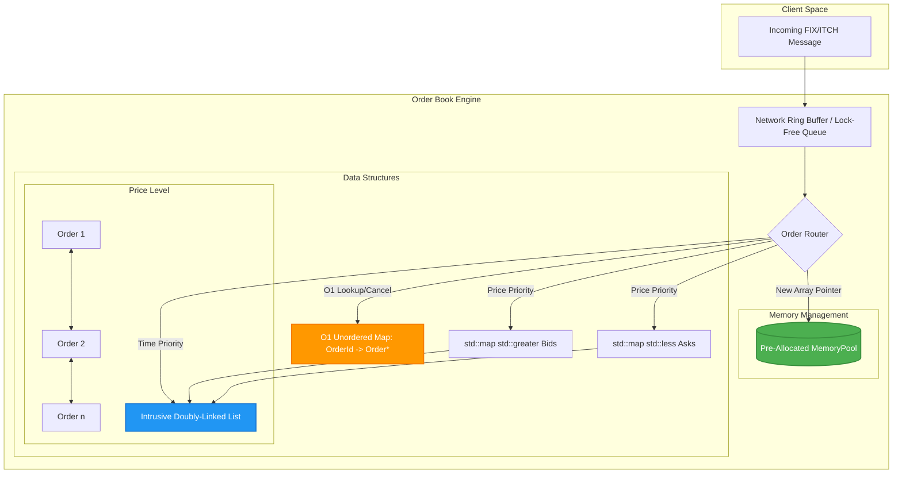

# High-Frequency Trading (HFT) Matching Engine

A blazingly fast Limit Order Book (LOB) matching engine written in modern C++17. Designed with the strict latency constraints of High-Frequency Trading (HFT) and quantitative finance in mind.


## System Architecture

The matching engine is built to maximize CPU cache hits and minimize operating system interruptions.


```mermaid
graph TD
    subgraph Client Space
        A[Incoming FIX/ITCH Message]
    end

    subgraph Order Book Engine
        B[Network Ring Buffer / Lock-Free Queue]
        C{Order Router}
        
        subgraph Memory Management
            P[(Pre-Allocated MemoryPool)]
        end
        
        subgraph Data Structures
            M[O1 Unordered Map: OrderId -> Order*]
            Tree[std::map std::greater Bids]
            Tree2[std::map std::less Asks]
            
            subgraph Price Level
                L[Intrusive Doubly-Linked List]
                O1[Order 1] <--> O2[Order 2] <--> O3[Order n]
            end
        end

        C --> |New Array Pointer| P
        C --> |O1 Lookup/Cancel| M
        C --> |Time Priority| L
        C --> |Price Priority| Tree
        C --> |Price Priority| Tree2
        Tree --> L
        Tree2 --> L
    end

    A --> B
    B --> C
    
    style P fill:#4CAF50,stroke:#388E3C,stroke-width:2px,color:#fff
    style L fill:#2196F3,stroke:#1976D2,stroke-width:2px,color:#fff
    style M fill:#FF9800,stroke:#F57C00,stroke-width:2px,color:#fff
```

## Performance Metrics

- **100,000 Orders Latency:** `~79 nanoseconds` (>12.5 million ops/sec)
- **1,000,000 Orders Latency:** `~126 nanoseconds` (>7.8 million ops/sec)
*(Measured on a standard consumer CPU utilizing GCC 6.3 Windows natively)*

## Core Design Principles

To achieve sub-microsecond latency, this engine adheres to the following strict C++ design principles:

### 1. Zero Dynamic Allocation on the Critical Path
In C++, `new` and `malloc` require expensive context switches to the Operating System. During active trading hours, we cannot afford this unpredictability. 
- **Solution:** A custom `MemoryPool<Order>` pre-allocates a massive contiguous block of memory on startup `(e.g., 1,000,000 orders)`. The matching engine simply hands out pointers to pre-allocated memory using a stack-based LIFO free-list. Allocation and deallocation are strictly $O(1)$ and never hit the OS.
- **Safety:** An allocation bitmap detects double-free bugs at runtime, preventing the same memory address from being returned to two callers.

### 2. Cache Locality & Intrusive Data Structures
Standard library containers (like `std::list`) allocate individual nodes across the heap, causing severe memory fragmentation and destroying CPU L1/L2 cache coherence via cache misses.
- **Solution:** We explicitly avoid `std::list`. Instead, we use **Intrusive Doubly-Linked Lists**. The `Order` struct itself contains the `next` and `prev` pointers. When an order is added to a `PriceLevel`, we merely update the pointers. This keeps the memory incredibly dense and cache-friendly.
- **Alignment:** Orders are `alignas(64)` to ensure they never straddle two 64-byte CPU cache lines on modern x86/ARM processors.

### 3. Price-Time Priority Matching
Orders are matched primarily on Price (highest bid vs lowest ask), and secondarily on Time (First-In, First-Out).
- **Price tracking:** `std::map` (ordered by `<Price, PriceLevel>`). Sparse prices are handled gracefully without large memory arrays.
- **Time tracking:** The intrusive linked list anchored within each `PriceLevel`.
- **$O(1)$ Cancellations:** An `std::unordered_map<OrderId, Order*>` provides instant lookup to cancel an order by simply unlinking its pointers from the `PriceLevel` without traversing the tree.

### 4. Structured Results & Input Validation
- **`OrderResult`** return type provides explicit `accepted` / `cancelled` flags — callers can distinguish between successful operations, rejections, and cancel failures.
- **Duplicate order IDs** are rejected before allocation, preventing memory pool leaks and dangling pointer corruption.
- **Zero-quantity orders** are rejected at the API boundary.

## API

```cpp
#include "OrderBook.h"

hft::OrderBook ob(1'000'000); // Pre-allocate for 1M resting orders

// Submit a limit order
hft::OrderResult result = ob.add_order(
    /*id=*/1, hft::OrderType::Limit, /*price=*/10050, /*qty=*/100, hft::Side::Buy
);

if (result.accepted) {
    for (const auto& trade : result.trades) {
        // Process fills: trade.maker_id, trade.taker_id, trade.price, trade.quantity
    }
}

// Cancel an order
hft::OrderResult cancel = ob.add_order(1, hft::OrderType::Cancel, 0, 0, hft::Side::Buy);
if (cancel.cancelled) {
    // Order was successfully removed from the book
}
```

## Build Instructions

Dependencies (GoogleTest, Google Benchmark) are automatically downloaded via CMake FetchContent — no manual installation required.

### Prerequisites
- GCC / G++ (or Clang) with C++17 support
- CMake ≥ 3.14

### Building (Release)

```bash
cmake -B build -DCMAKE_BUILD_TYPE=Release
cmake --build build --config Release -j$(nproc)
```

### Building (Debug with Sanitizers)

Debug builds automatically enable AddressSanitizer and UndefinedBehaviorSanitizer to catch memory bugs:

```bash
cmake -B build-debug -DCMAKE_BUILD_TYPE=Debug
cmake --build build-debug --config Debug -j$(nproc)
```

### Running

```bash
# Custom benchmark (4 separate workloads)
./build/hft_engine

# Google Test suite (28 test cases)
./build/hft_tests

# Google Benchmark (microbenchmarks)
./build/hft_bench
```

## Example Output

```text
=== HFT Matching Engine Benchmark ===

[1] Pure Insertion: 1000000 passive sell orders...
    Inserted 1000000 orders in 198432 us
    Avg latency: 198.4 ns/op

[2] Pure Matching: 100000 aggressive buy orders against 100000 resting sells...
    Matched 100000 orders in 12340 us
    Avg latency: 123.4 ns/op

[3] Pure Cancellation: 500000 cancel operations...
    Cancelled 500000 orders in 89231 us
    Avg latency: 178.5 ns/op

[4] Mixed Workload: 1000000 ops (70% insert, 20% match, 10% cancel)...
    Processed 1000000 ops in 203421 us
    Avg latency: 203.4 ns/op

Engine run complete. Built for microsecond latency.
```

## Production Considerations

This project represents the core "matching loop" used by actual financial exchanges (like NASDAQ or Binance) to process raw FIX or ITCH protocol feeds. The next steps for scaling this into full production would be:
1. Adding SPSC (Single-Producer Single-Consumer) Lock-Free Queues to receive network packets from a separate I/O network thread.
2. Replacing `std::map` with an Array-Backed Flat Map utilizing `std::vector` for incredibly dense price increments (tick sizes) to eliminate pointer chasing across tree nodes.
3. Implementing Self-Trade Prevention (STP) for regulatory compliance.
4. Adding transactional exception safety guards around the matching loop.