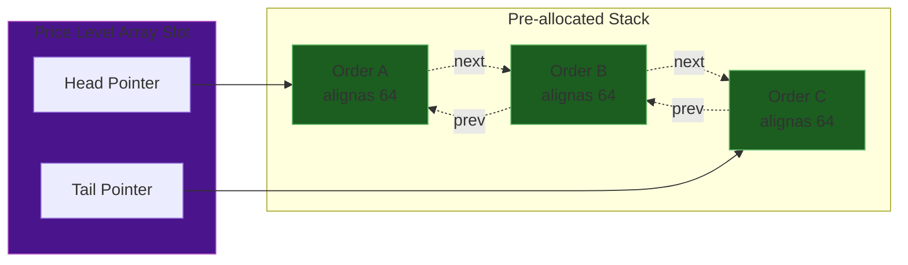

# Deep-Dive Architecture & Memory Layout

## 1. Data Structure Justifications

High-Frequency Trading matching engines cannot afford the unpredictability of generic standard library containers. Below is a formal complexity justification for the fundamental components of our architecture.

### Price Levels: Flat Array vs. `std::map`

| Operation | `std::map<Price, PriceLevel>` | `std::vector<PriceLevel>` (Our Engine) |
| :--- | :--- | :--- |
| **Lookup** | $O(\log N)$ | $O(1)$ |
| **Insertion** | $O(\log N)$ + heap allocation | $O(1)$ |
| **Deletion** | $O(\log N)$ + heap free | $O(1)$ |
| **Cache Behavior** | Very Poor (Pointer Chasing) | Excellent (Contiguous) |

**Rationale:** `std::map` relies on Red-Black Trees. Navigating to the Best Bid requires traversing pointers scattered randomly across the heap, guaranteeing L3 cache misses. By constraining prices within `[min_price, max_price]`, we map Price strings directly to array offsets `array[price - min_price]`. The cost of reserving a large memory block upfront is completely offset by the $O(1)$ constant-time lookup.

### Order Tracking: `unordered_map` vs. Flat Array

**Rationale:** While `std::unordered_map` claims $O(1)$ amortized lookup, it uses separate chaining (linked lists) to resolve bucket collisions. This means dynamically allocating memory upon hash conflicts. Our engine replaces this with a simple `std::vector<Order*> order_map_`. A lookup is just a pointer read: `order_map_[order_id]`.

---

## 2. Intrusive Doubly-Linked Lists

To maintain Price-Time priority without dynamic memory churn, Orders represent nodes in an intrusive doubly-linked list.



When an order is cancelled, we grab the pointer from `order_map_` in $O(1)$, and immediately detach it from the list in $O(1)$ by connecting `order->prev->next` to `order->next->prev`.

---

## 3. Memory Pool Mechanics

The core rule of C++ HFT engines is **Zero Dynamic Allocation on the Critical Path**. The `MemoryPool<Order>` implements this.

### State Overview

The `MemoryPool` pre-allocates an array of `N` `Order` structs inside a single contiguous `std::vector`. On startup, it stitches them into a LIFO stack.

```mermaid
graph TD
    subgraph Initialization [Boot Up]
        A[vector allocation] --> B[next_free_ = &pool[0]]
        B --> C[pool[0].next = &pool[1]]
        C --> D[pool[1].next = &pool[2]]
        D --> E[...]
    end
```

### Allocation Flow ($O(1)$)
When an order arrives, `engine` calls `pool.allocate()`:
1. `obj = next_free_`
2. `next_free_ = obj->next` (Advances stack)
3. Bitmap flips `allocated_[index] = true`
4. Returns `obj`.

### Deallocation Flow & Double-Free Protection
When an order executes or cancels:
1. Engine calls `pool.deallocate(ptr)`
2. Calculates index via pointer arithmetic: `ptr - pool.data()`
3. Checks `allocated_[index]`. If `false`, it throws `std::logic_error("Double free detected")`. This is vital because double-frees corrupt the LIFO structure, causing two clients to own the same memory address.
4. Flips `allocated_[index] = false`.
5. Pushes back to stack: `ptr->next = next_free_; next_free_ = ptr;`

This technique completely bypasses the OS `malloc`/`free` global locks, resolving all memory operations within CPU registers.
